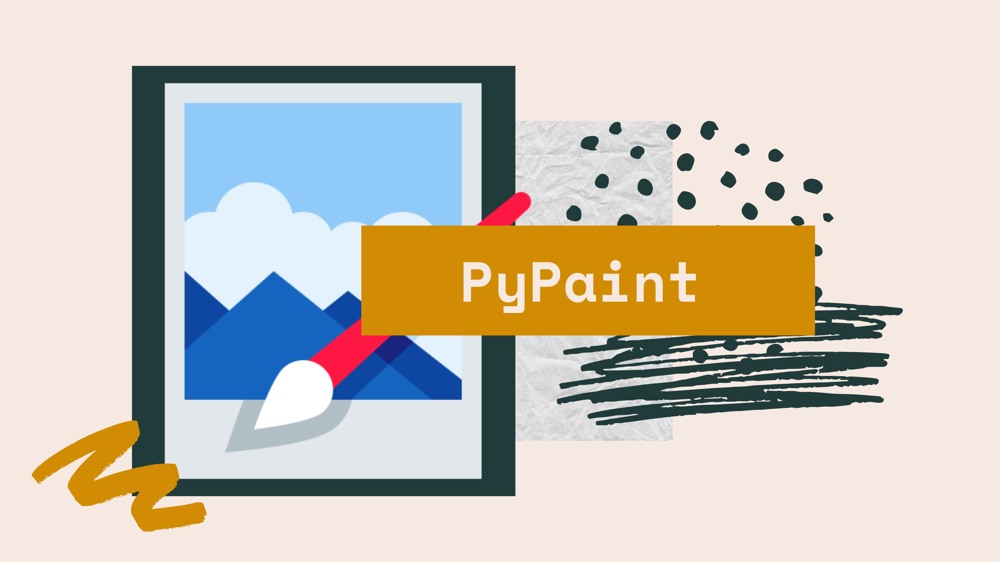
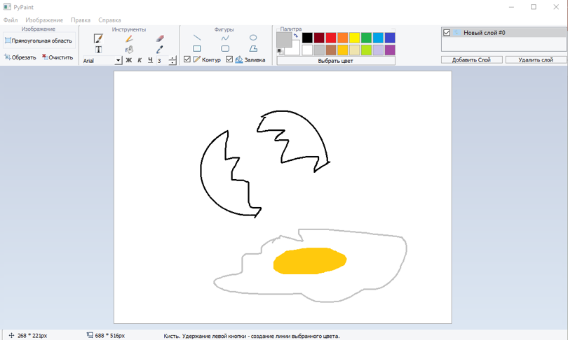
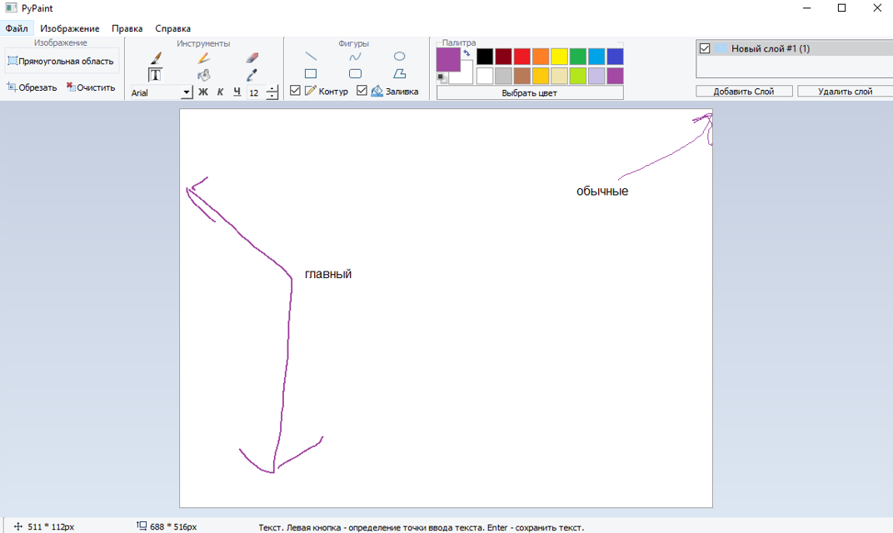
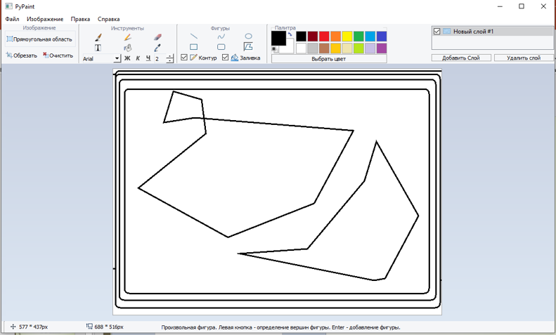
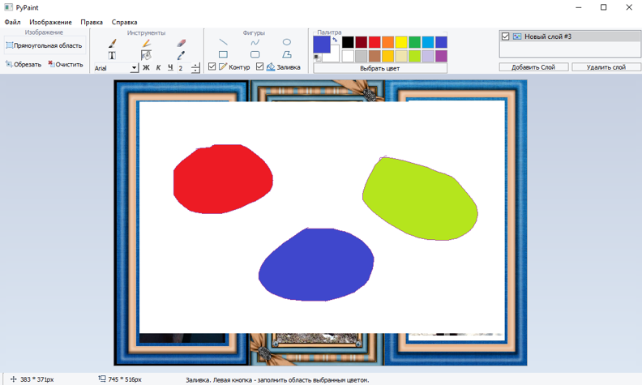
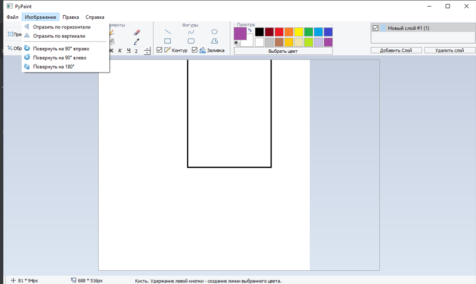
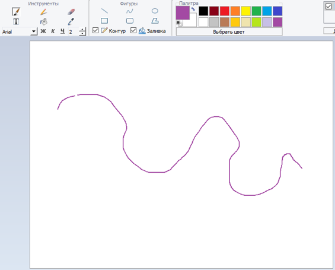

# PyPaint — A desktop application in PyQt

## Description
PyPaint - это многофункциональный, но в то же время довольно простой в использовании растровый графический редактор.
С её помощью можно создавать картинки с подписью, минимально редактировать фотографии, 
делать подписи, создавать комиксы, открытки, инфографику, мемы и рисунки.

Наш проект был вдохновлен известной программой для редактирования изображения – Paint. 
Мы решили, что python может создать аналог этой популярной программы, в чем-то даже обогнав ее.

## About the project
Наша программа состоит из нескольких слоев
Один слой – главный. Он концентрирует на себе все остальные слои, чтобы они накладывались на друг друга.
Остальные слои – обычные. Каждый из них может менять себя, если он на данный момент является активным.

Что может наш PyPaint?
- Он может рисовать фигуры
- И простейшие линии с помощью различных инструментов
- Открывать, сохранять файлы
- Удалять все в зоне выделенного прямоугольника
- Работать со слоями
- Работать с историей
- Простейшие манипуляции с изображением
- Возможность загрузки, редактирования и записи в файл полноэкранных изображений.
- Одна из ценных возможностей - отмена результатов последних операций. Она реализуется командой Назад и Вперёд в позиции Правка Главного меню.

В программе есть стандартные инструменты, включая карандаш, кисть, заливку, ластик, текст, ряд фигур и другие.
Библиотека фигур содержит как стандартные эллипсы, прямоугольники, векторы так и произвольные фигуры.

Вы можете копировать из изображения с произвольной формой. 
Загруженные изображения автомотически подгоняются под размер холста и центрируются для наибольшего 
удобства пользователя.
Кроме того, сервис позволяет подрезать изображение, вращать его на 90 градусов или отражать по горизонтали или вертикали.

### Главное меню редактора PyPaint содержит следующие позиции:

* Файл - операции с файлами (задание нового файла, загрузка файла, запись файла с текущим и измененным именем).
* Правка - отмена предыдущих действий и повтор результатов отмененного действия.
* Изображение - операции с выделенными изображениями (поворот, инверсия).
* Справка - обращение к справке по графическому редактору.

### Рабочее поле PyPaint. 

Центральную часть окна PyPaint занимает рабочее поле - участок экрана, на котором вы рисуете картинку. Размер картинки может превышать размер рабочего поля, - в этом случае изображения автомотически подгоняются под размер холста.

### Панель инструментов PyPaint. 

В верхней части окна PyPaint находится панель инструментов, каждый из которых обозначен небольшой картинкой-пиктограммой. 
Такая пиктограмма может представлять не только настоящий «инструмент», но и некоторую операцию, которая выполняется после выбора этого «инструмента».

### Информационный блок PyPaint. 

В нижей части экрана можно увидеть размер картинки и всплывающие подсказки к использованию инструментов.

## How to use

Чтобы выбрать инструмент, достаточно щелкнуть на нем мышью. Пиктограмма выбранного инструмента выделяется цветом. 
Если вы хотите воспользоваться, скажем, ластиком, просто щелкните на нем, - пиктограмма ластика будет выделена.

Досутпны следующие инструменты:
* Кисточка. Указатель мыши превращается в «кисть».
* Ластик. Указатель мыши превращается в квадратный «ластик». Перемещая его, мы «стираем» участки изображения или меняем цвет символа на цвет фона.
* Заливка. Указатель мыши превращается в «баночку с краской». Если поместить его внутрь замкнутой полости и щелкнуть мышью, эта полость будет закрашена текущим цветом символа.
* Пиптека. Даёт возможность определить цвет на экране.
* Ввод текста. После выбора этого инструмента вы должны установить указатель в точку ввода строки текста и щелкнуть мышью, после чего ввести текст и нажать Enter. Текст может быть разного размера, цвета, курсива и шрифта.
* Полые и окрашенные геометрические фигуры. Выбрав любой из этих инструментов, мы получаем возможность нарисовать курсором мыши полую или окрашенную фигуру: прямоугольник, квадрат, эллипс, окружность, многоугольник и т.д.
* Кривая линия. Выбор этого инструмента дает нам возможность нарисовать указателем прямую линию, а затем изогнуть ее в причудливую дугу.
* Прямая линия. Этим инструментом мы можем проводить прямые линии под любым углом к вертикали экрана.

## Code notes
Первые две константы – шаблоны ручек для рисования
Константы цветов отвечают позволяют быстро переключать цвета
Класс history представляет из себя список, по функционалу напоминающий историю из фоторедактора
MainWindow – главный класс. Импортирует MainWindow.ui для отображения интерфейса. Содержит в себе все метожы
Последний отвечает за появления окошка «О проекте»

Все инструменты реализованы с вложенными обработчиками событий, которые при необходимости пересылают события. 
Это позволяет повторно использовать много кода между инструментами, 
которые имеют общее поведение (например, рисование фигур). 
Для добавления анимации выбора области требуется таймер (для обновления ползучих муравьев), 
что добавило некоторой сложности.

Чтобы слой поменял себя, вызывается метод update_current_layer(), который имеет три метода работы:
Обычный. Когда нужно сразу же разместить на себе операцию. Применимо для карандаша, кисти, заливки и и.д.
Временный. Когда нужно временно отобразить что-либо. Применимо для отрисовки временной границы фигур
Релиз. Когда нужно окончательно разместить на себе операцию и добавить ее в историю

## Modules
- Sqlite, csv – для работы подсказок при выборе инструмента
- Math – для рисования кривой линии
- Random – для красивого показа окошка «О программе»
- Re – для замены одинаковых имен
- PyQt5 – для работы приложения

## Future scope

Можно также и добавить новые методы до блеска, чтобы пользователь мог получать самые приятные эмоции при использовании нашего продукта.

